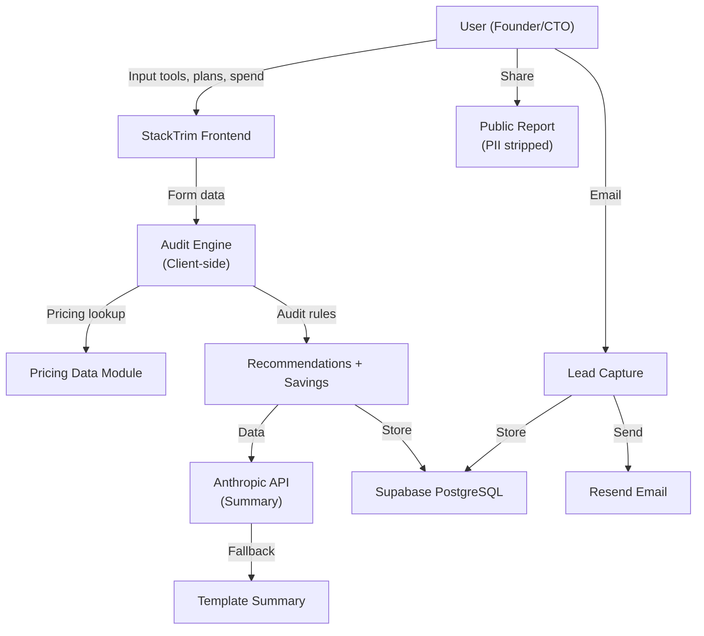

# Architecture & System Design

## System Diagram

## Data Flow

1. **User Input** → Form: company, team size, use case, tools (plan + seats + spend)
2. **State Persistence** → localStorage; survives reload
3. **Audit Execution** → For each tool: fetch pricing, apply 5 rules, calculate savings
4. **LLM Enrichment** → Anthropic API (with fallback template)
5. **Lead Capture** → Email + metadata to Supabase
6. **Shareable URL** → Encode audit + OG tags

## Core Audit Rules

| Rule | Logic | Example |
|------|-------|---------|
| **Plan-Fit Downgrade** | Team size < 5 on Business/Team plan → suggest Pro | Cursor Teams for 3 people → Pro saves $60/mo |
| **Tool Overlap** | 2+ coding tools or 3+ chat tools → consolidate | Claude + ChatGPT + Gemini → keep 2 saves 25% |
| **Credit Opportunity** | Spend > $500/mo → Credex credits could save 30% | $1.2K OpenAI API → Credex credits |
| **Usage Mismatch** | Ultra/Max plan for non-coding work → downgrade | Claude Max for writing → Pro is enough |
| **Custom Spend** | API spend > 1.5x standard plan → switch to transparent | $500/mo unknown spend → likely Team plan |

## Stack Rationale

**Frontend:** Vanilla JS (4 KB gzipped) vs React (40+ KB)
- Audit logic is simple; no component state needed
- Runs offline; users don't need runtime
- Auditable: every price visible in source code

**Audit Engine:** Client-side (not API)
- Transparency: users see logic in browser console
- No server round-trip; <100ms execution
- Scales horizontally (every user runs their own)

**LLM:** Anthropic (not OpenAI)
- Better reasoning; Sonnet = quality + cost sweet spot
- Free credits available; competitive pricing

**Backend:** Supabase (not Firebase)
- PostgreSQL for complex future queries
- No vendor lock-in; self-hostable
- Free tier generous enough for MVP

**Hosting:** Vercel (not self-hosted)
- Zero-config deployment
- Edge functions for future scaling
- Free tier works for MVP

## What Changes at 10k Audits/Day?

1. **Pricing:** Redis cache + hourly cron (not in-memory JS module)
2. **Audit Logic:** Move to Node.js API server (not client-side) for better rate limiting + versioning
3. **LLM:** Async queue (Bull) + background workers (not request-path blocking)
4. **Database:** Indexes on `(email, created_at)` and `(monthly_savings DESC)`; partition by month if >100M rows
5. **Rate Limiting:** IP-based (10/hour) + auth-based (100/day) via Redis
6. **Monitoring:** Sentry, PostHog, DataDog for observability

## Performance Targets

- **Lighthouse (Mobile)**
  - Performance: 85+ (LCP <2.5s, no layout shift)
  - Accessibility: 90+ (WCAG AA, keyboard nav)
  - Best Practices: 90+ (HTTPS, no deprecated APIs)

- **Core Metrics**
  - Audit completion: <100ms
  - Page load: <1s
  - API latency: <500ms (with fallback to template if slow)

## Why This Shape

The assignment rewards a working product with defensible audit logic, so the core decision was to keep the math deterministic and inspectable. The app does not ask an LLM to decide savings. It uses official pricing data plus rule-based recommendations, then uses AI only to summarize the result.

## Components

- `index.html`: product surface and semantic structure.
- `src/main.js`: UI state, persistence, report rendering, share links, and API calls.
- `src/pricing-data.js`: vendor plan data and official source URLs.
- `src/audit-engine.js`: deterministic spend math and recommendation rules.
- `server.mjs`: optional Node backend for summary generation, lead capture, rate limiting, and transactional email.
- `tests/audit-engine.test.js`: automated coverage for the audit engine.

## Recommendation Logic

The MVP checks:

- Whether a small team is paying for a team plan when individual plans fit.
- Whether a high custom/API bill should trigger a transparent team plan or Credex credit conversation.
- Whether multiple coding assistants or general chat tools overlap.
- Whether no savings should be reported because the current setup appears reasonable.

The output is intentionally conservative. A finance-literate buyer should be able to follow the recommendation from current spend to proposed action.

## What I Would Change Next

- Add a pricing sync job with vendor-page snapshots.
- Persist reports server-side with short public IDs.
- Add PDF export and embed widget modes.
- Add benchmark cohorts by company size and developer count.
- Add a real CRM handoff for high-savings Credex opportunities.
