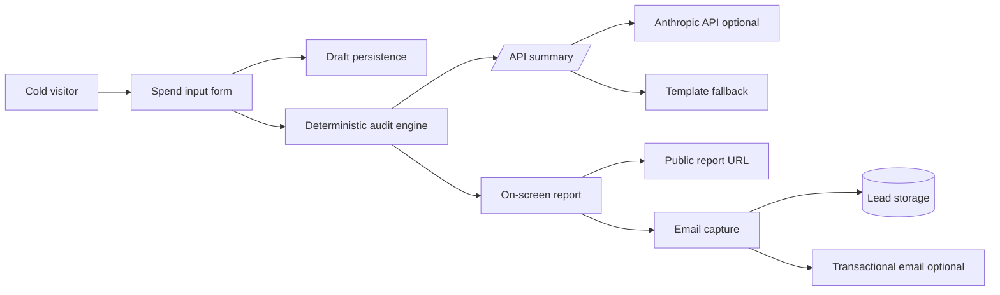

# StackTrim AI Spend Audit

StackTrim is a free web app for startup founders, CTOs, and engineering managers who want a fast second opinion on AI tooling spend. Users enter their AI tools, plans, seats, monthly spend, team size, and primary use case; the app returns plan-fit recommendations, duplicate-tool savings, annualized savings, and a public report URL that strips company and email details.

## Screenshots

Add a deployed screenshot or a 2-minute Loom/YouTube walkthrough before submission.

## Quick Start

```bash
npm install
npm run dev
```

Open `http://localhost:5173`.

Optional environment variables:

```bash
ANTHROPIC_API_KEY=...
ANTHROPIC_MODEL=claude-sonnet-4-5
RESEND_API_KEY=...
RESEND_FROM_EMAIL="StackTrim <audit@yourdomain.com>"
LEAD_TO_EMAIL=founder@yourdomain.com
```

Without those variables, the app still works: the AI summary falls back to a deterministic template, leads are stored locally by the server, and browser fallback stores leads in `localStorage`.

## Deploy

Deploy as a Node app on Render, Fly.io, Railway, or any equivalent platform:

```bash
npm run build
npm start
```

Live deployed URL: `TBD`

## Decisions

- I used vanilla JavaScript modules instead of a framework because the MVP needs near-zero install friction, quick loading, and no UI template dependency. TypeScript would be my default for a larger team build, but for this submission the audit engine is small and covered by Node tests.
- The audit math is deterministic. AI is used only for the personalized summary, with a graceful fallback when the API fails.
- The public report URL encodes only non-identifying audit inputs and results. Email and company name stay out of share links.
- The backend is intentionally thin: rate-limited API endpoints for summary generation and lead capture, file-backed local storage for development, and optional Resend email for production.

## System Diagram



## Data Flow

1. User inputs company context and tool spend.
2. Browser persists the draft to `localStorage`.
3. The audit engine calculates current spend from official plan data or user-entered custom spend.
4. Rules evaluate plan fit, duplicate tool overlap, and Credex credit opportunities.
5. Results render immediately, then `/api/summary` adds an AI summary or fallback text.
6. Share links encode a redacted report payload in the URL.
7. Lead capture posts to `/api/leads`, stores the lead, and optionally sends a confirmation email.

## Stack Choice

Vanilla JS, CSS, and a Node HTTP server keep the app easy to run and deploy without private dependencies. The tradeoff is less compile-time type safety than TypeScript, so the core business logic is isolated in `src/audit-engine.js` and covered by tests.

## Scaling To 10k Audits/Day

- Move lead storage from local JSON to Postgres or Supabase with idempotency keys.
- Put reports behind short IDs instead of large encoded URLs.
- Add durable rate limiting with Redis or Cloudflare Turnstile.
- Cache pricing data and attach a version to every audit.
- Queue transactional email and CRM sync jobs.
- Add server-side rendering for report pages so Open Graph previews include exact savings numbers.

## Tests

```bash
npm test
```

The tests cover plan spend calculations, custom API spend, duplicate coding-tool detection, high-savings Credex fit, and AI-summary fallback behavior.
